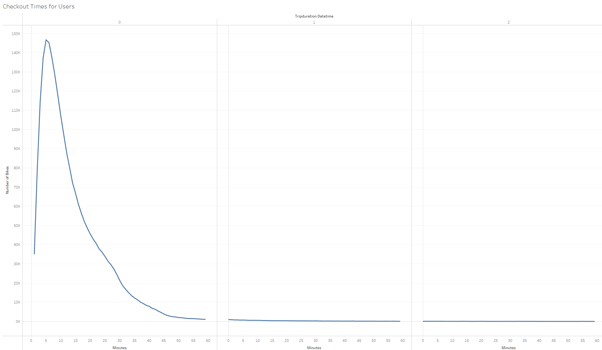
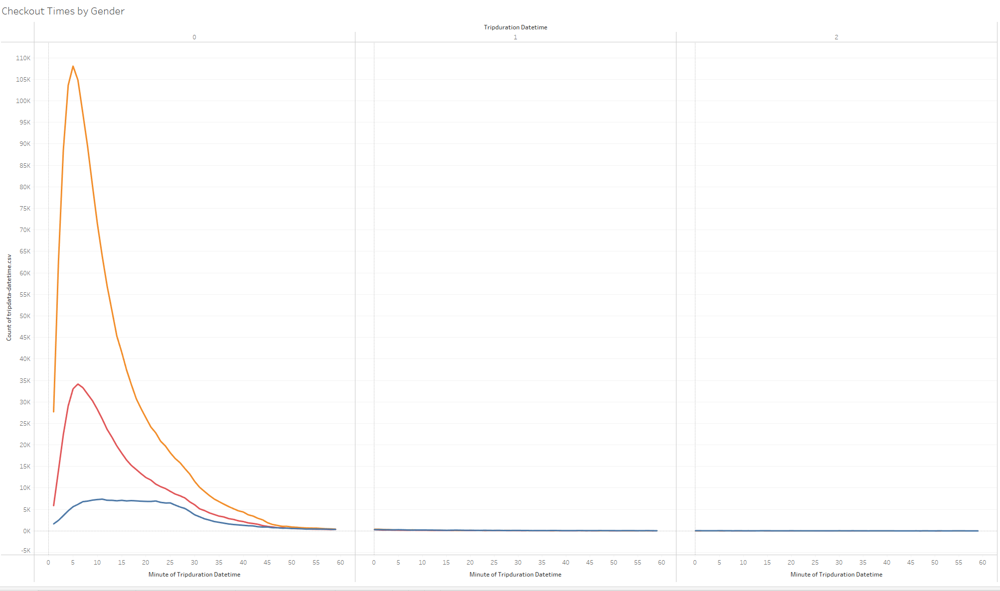
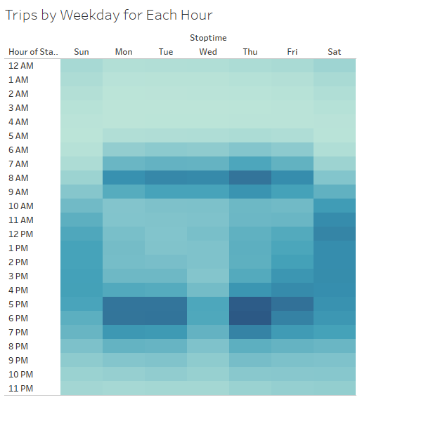
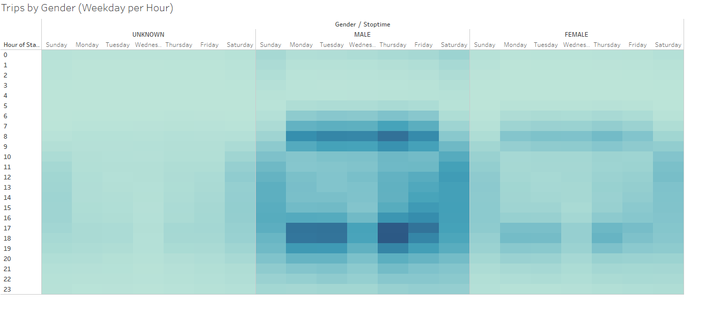
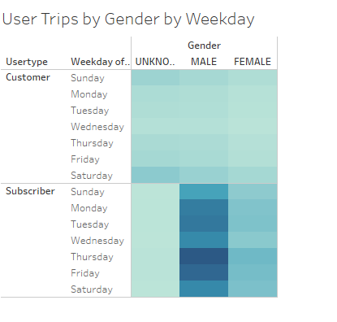

# bikesharing

## Overview

The purpose of this analysis is to use the NYC CitiBike dataset to examine service utilization by trip duration, time, gender, and customer type.

## Results

Most trips last for about half an hour, while no trips last longer than an hour.

Most trips are by male riders, followed by female riders and riders of unknown gender.

Most weekday rides are in the morning or evening, with weekend rides more distributed throughout the day.

Male and female riders have relatively the same distribution of ride times, while unknown gender riders are more weighted toward the afternoon and evening.

Male and female riders have relatively the same distribution of ride times, while unknown gender riders are more weighted toward the afternoon and evening.

## Summary

The visualizations show that most Citibike users are male subscribers who take trips under 30 minutes in the morning or evening on weekdays. Male utilization is more than three times the female utilization of the Citibike service. The following two visualizations could provide additional insight:

- Checkout times by gender during summer months.
- Checkout times by gender during winter months.

## Link

Follow [this link to view the Tableau story on Tableau Public](https://public.tableau.com/app/profile/karl.winterling/viz/ChallengeWorkbook_16703767815050/NYCBikeData?publish=yes).
